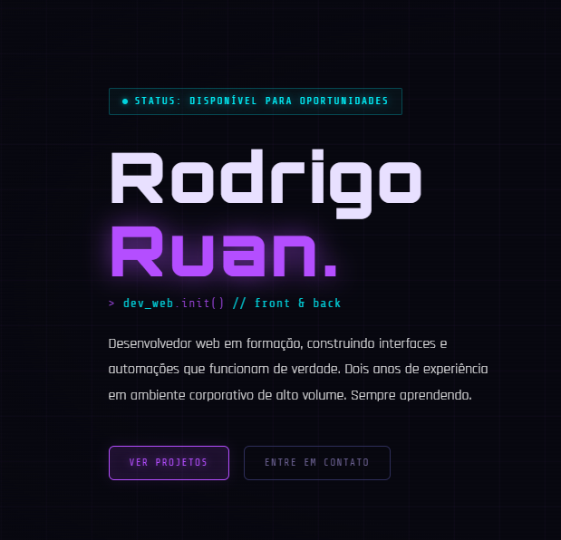
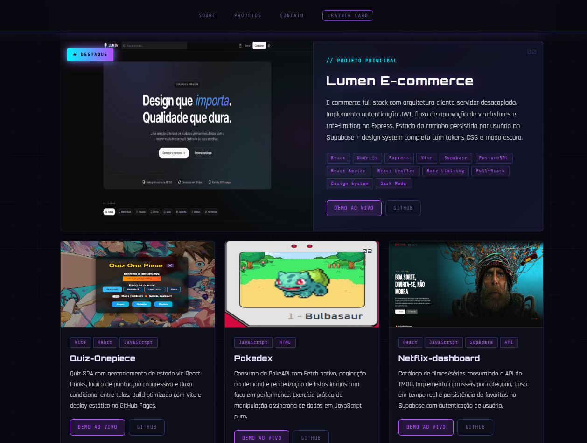
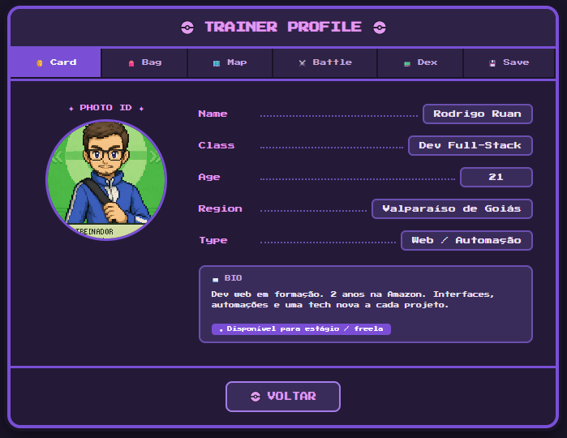

<div align="center">



# Rodrigo Ruan — Portfólio

**Dev Web Frontend**

[](https://rodrigoruan2.github.io/Portifolio/)
[](https://rodrigoruan2.github.io/Portifolio/trainer/)
[](https://www.linkedin.com/in/rodrigo-oliveira-141499258)

</div>

---

## Sobre

Portfólio pessoal com estética **cyberpunk/dark**, construído do zero em HTML, CSS e JavaScript puro — sem frameworks, sem dependências. Apresenta minha trajetória, stack e os projetos que desenvolvi, com foco em interfaces bem cuidadas e experiência do usuário.

Inclui também um **Trainer Card** interativo feito em React + Vite, navegável por abas no estilo de jogo de RPG.

---

## Preview

### Seção de Projetos



### Trainer Card



---

## Projetos em destaque

| # | Projeto | Stack | Links |
|---|---------|-------|-------|
| 00 | **Lumen E-commerce** | React · Node.js · Express · Supabase · PostgreSQL | [Demo](https://rodrigoruan2.github.io/lumen-ecommerce/) · [GitHub](https://github.com/RodrigoRuan2/lumen-ecommerce) |
| 01 | **Quiz One Piece** | React · Vite | [Demo](https://rodrigoruan2.github.io/Quiz-Onepiece2/) · [GitHub](https://github.com/RodrigoRuan2/Quiz-Onepiece2) |
| 02 | **Pokedex** | JavaScript · PokeAPI | [Demo](https://rodrigoruan2.github.io/pokedex/) · [GitHub](https://github.com/RodrigoRuan2/pokedex) |
| 03 | **Netflix Dashboard** | React · TMDB API · Supabase | [Demo](https://rodrigoruan2.github.io/netflix-dashboard/) · [GitHub](https://github.com/RodrigoRuan2/netflix-dashboard) |
| 04 | **Tradutor OCR** | Python · Tesseract · customtkinter | [GitHub](https://github.com/RodrigoRuan2/tradutor-ocr) |
| 05 | **Calendário de Anime** | React · Axios | [Demo](https://rodrigoruan2.github.io/anime-calendar-V3/) · [GitHub](https://github.com/RodrigoRuan2/anime-calendar-V3) |

---

## Stack do portfólio

```
HTML5 · CSS3 · JavaScript ES6+ · React 18 · Vite · GitHub Pages
```

---

## Contato

<div align="center">

[](mailto:ruancamisaazul@gmail.com)
[](https://www.linkedin.com/in/rodrigo-oliveira-141499258)
[](https://wa.me/5561992153423)
[](https://github.com/RodrigoRuan2)

</div>

---

<div align="center">Feito por <strong>Rodrigo Ruan</strong></div>
